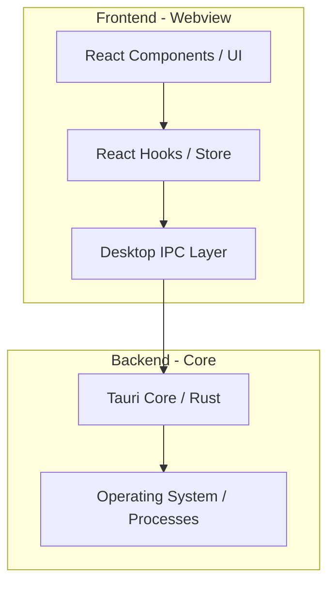
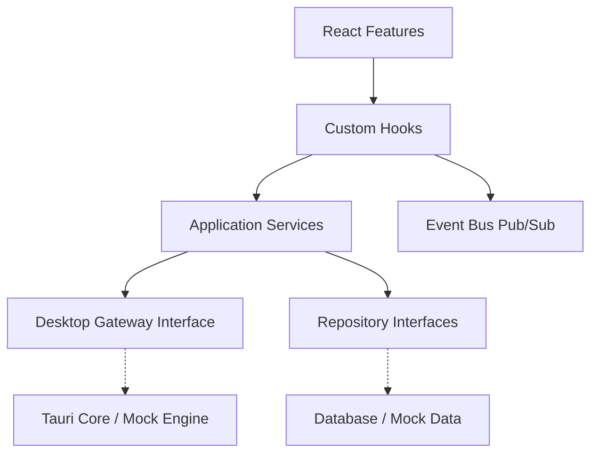
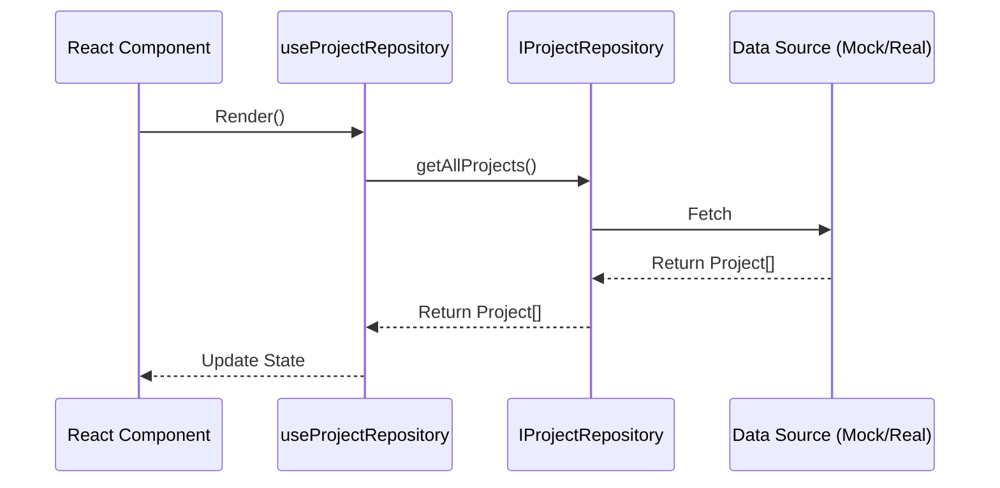
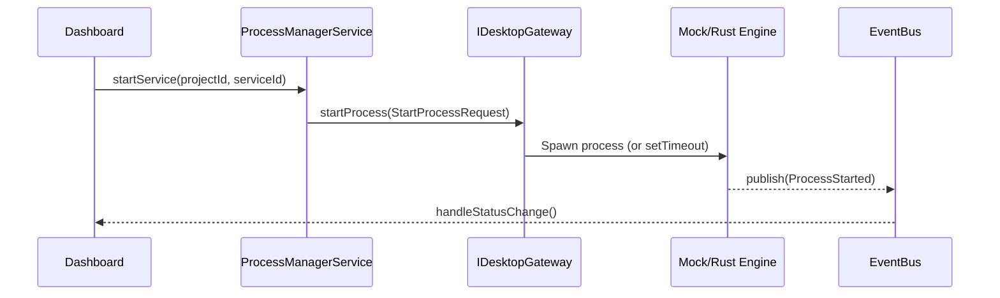
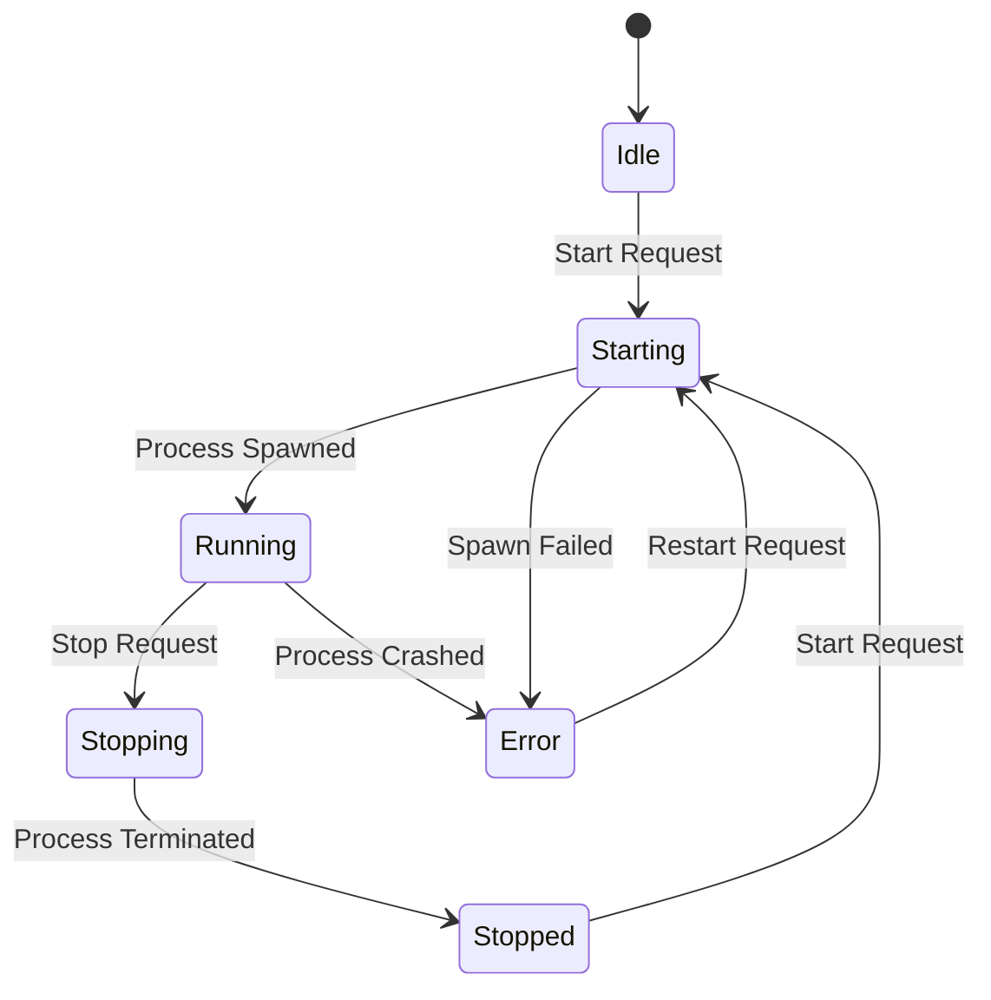
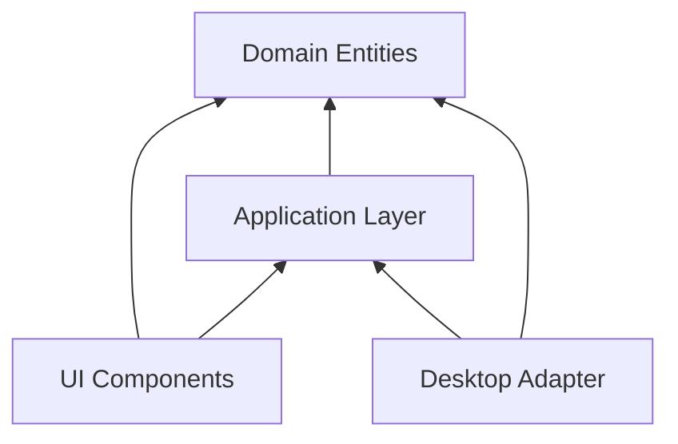

# Developer Control Center

Developer Control Center là ứng dụng Desktop giúp quản lý, khởi động, và giám sát các dự án phát triển (Spring Boot, React, Node.js, Rust...) thông qua giao diện đồ họa trực quan (GUI) hiện đại, thay vì phải thao tác thủ công qua Command Line.

## 🌟 Architecture Diagram & IPC Flow

Kiến trúc dự án được thiết kế chuẩn **Clean Architecture** và chia theo **Feature-sliced design** để dễ dàng duy trì trong nhiều năm mà không cần đập đi xây lại.



### IPC Flow (Tiến trình giao tiếp)
1. **User Action:** Người dùng bấm "Start Project" trên giao diện React.
2. **React Layer:** Component gọi hàm trong Store/Service tương ứng của tính năng.
3. **IPC Layer:** Store không gọi trực tiếp OS, mà mượn qua một Interface trung gian `IpcService` (ví dụ `desktopIpc.startProcess(id)`).
4. **Rust Backend:** Tauri nhận lệnh qua System IPC, thực thi shell command/spawn process.
5. **Callback/Event:** Rust emit sự kiện ngược về Frontend (VD: log stream, process status).

## 📁 Cấu trúc thư mục (Folder Tree)

```text
E:\Github project\Developer-Control-Center\
├── src-tauri/             # Backend (Rust)
│
├── src/                   # Frontend (React + TS)
│   ├── domain/            # Lớp nghiệp vụ lõi (Entities, Interfaces)
│   │   ├── entities/      # Project, Service, LogEntry...
│   │   ├── repositories/
│   │   └── usecases/
│   │
│   ├── desktop/           # Cầu nối giữa UI và HĐH (Chứa toàn bộ Tauri API calls)
│   │   ├── ipc/           # Định nghĩa IPC Services
│   │   ├── process/
│   │   ├── shell/
│   │   └── filesystem/
│   │
│   ├── shared/            # Code dùng chung (UI Components, Utils, Types)
│   │   ├── components/    # (ví dụ: Button, Layout, shadcn/ui)
│   │   ├── hooks/
│   │   ├── types/
│   │   └── utils/
│   │
│   └── features/          # Các phân hệ theo chuẩn Feature-sliced
│       ├── dashboard/
│       ├── projects/
│       ├── processes/
│       ├── logs/
│       ├── workspace/
│       ├── settings/
│       └── terminal/
│           ├── components/ # UI dành riêng cho feature
│           ├── hooks/      # Hook chuyên biệt
│           ├── services/   # Giao tiếp API/IPC
│           ├── stores/     # Zustand state
│           ├── types/      # Types cụ thể cho feature
│           └── pages/      # Entry view (Trang)
└── README.md
```

## 🧩 Module Responsibilities

1. **Domain (`domain/`)**: Chứa định nghĩa dữ liệu (Interfaces/Types), không chứa bất kỳ logic UI hay framework nào.
2. **Desktop (`desktop/`)**: Là adapter duy nhất giao tiếp với Rust/Tauri API. React không được gọi Tauri API ngoài module này.
3. **Shared (`shared/`)**: Chứa các component dùng chung (reusable components) và các hook tiện ích, không chứa business logic đặc thù của từng feature.
4. **Features (`features/`)**: Chứa logic độc lập của từng chức năng. Các feature KHÔNG được import chéo nhau quá sâu (chỉ nên giao tiếp qua Shared hoặc Domain).

## 📝 Naming & Coding Convention

- **Thư mục & File:**
  - File UI Components: `PascalCase.tsx` (VD: `ProjectList.tsx`).
  - File Utils/Hooks/Services: `camelCase.ts` (VD: `useProject.ts`, `dateFormatter.ts`).
  - Tên thư mục: `kebab-case` hoặc `camelCase` chữ thường (VD: `dashboard`, `shared-components`).
- **Interfaces & Types:** Sử dụng `PascalCase` (VD: `Project`, `ProcessInfo`).
- **Imports:** 
  - Ưu tiên sử dụng absolute path (Alias: `@/shared/...`, `@/features/...`).
  - Không import component từ feature này sang feature khác (nếu dùng chung, hãy đem ra `shared/`).

## 🎨 UI Foundation & Design System

Dự án áp dụng một **Design System** toàn diện theo tiêu chuẩn của các IDE hiện đại (VS Code, Docker Desktop).

- **Colors & Themes:** Hỗ trợ Light/Dark mode mặc định thông qua CSS Variables. Các biến màu bao gồm primary, success, danger, warning, info, surface, background, border...
- **Typography & Scale:** Thiết lập chuẩn cho Display, Heading, Body, Caption, Mono.
- **Shared Component Library (Atomic UI):** Hệ thống được xây dựng trên bộ primitive component từ `shadcn/ui` và Headless UI (chạy qua Radix). Tất cả nằm tại `src/shared/components/ui/` và hoàn toàn tuân thủ Component < 300 dòng, không dính líu đến logic business.
- **Icon System:** Wrapper `Icon.tsx` tự động bọc `lucide-react`.

## 🧩 Kiến trúc Application Layer & Sơ đồ mở rộng

Dự án sử dụng mô hình Dependency Injection, chia cắt UI hoàn toàn với hệ thống (OS/Tauri).

### Application Layer Diagram


### Repository Flow


### IPC Flow & Desktop Adapter


### Process State Machine


### Dependency Graph


## 🚀 Hướng dẫn chạy

> **Lưu ý quan trọng:** Bạn cần cài đặt **Rust** để có thể build thành ứng dụng Desktop.
> Tham khảo: [https://www.rust-lang.org/tools/install](https://www.rust-lang.org/tools/install)

**Chạy ở chế độ Web (Frontend Only):**
```bash
npm install
npm run dev
```
*(Hiện tại dự án đang chạy hoàn toàn trên Mock Data - Không yêu cầu Backend)*

**Chạy ứng dụng Desktop:**
```bash
npm run tauri dev
```

## 🚀 Các Tính Năng Đã Triển Khai (Implemented Features)

### 1. 📊 Multi-Account AI Quota & Cloud Monitoring (AG-9.0 → AG-9.96)
- **Multi-Account OAuth & Discovery:** Quản lý đồng thời nhiều tài khoản Google Cloud Code & Antigravity với cơ chế tự động phát hiện (Zero-config discovery) và token refresh lifecycle.
- **Smart Polling Engine:** Động cơ polling nền tự động điều chỉnh chu kỳ, hỗ trợ reconnect tự động khi khởi động và quản lý trạng thái tài khoản.
- **Real-time Quota Dashboard & Insights:** Hiển thị trực quan hạn ngạch (Quota limit, usage, reset window), biểu đồ xu hướng, cảnh báo thông minh (Smart Alerts) và gợi ý tài khoản tối ưu.

### 2. 🛡️ Security Engine & Vulnerability Scanner
- **Secret & Credential Scanner:** Phát hiện lộ lọt API keys, tokens, SSH keys, chứng chỉ bảo mật trong mã nguồn.
- **Dependency & Configuration Scanner:** Quét lỗ hổng thư viện phụ thuộc (tích hợp OSV database) và phát hiện cấu hình thiếu an toàn.
- **Git Exposure & Scope Analysis:** Kiểm tra rò rỉ lịch sử commit, file `.git`, và kiểm soát phạm vi quét (Folder Scope / Exclusion Filters).
- **Evidence-Based Findings:** Báo cáo chi tiết vị trí lỗ hổng kèm mã minh chứng (Evidence tracking) và hướng dẫn khắc phục cụ thể.

### 3. ⚙️ CI/CD Pipeline Engine & Scope Discovery
- **Project Intelligence & Scope Discovery:** Tự động phân tích cấu trúc dự án (Node.js, Rust, Python, Go...), nhận diện build tools và dependencies để tổng hợp pipeline.
- **Multi-Platform Pipeline Generator:** Tạo cấu hình CI/CD tự động cho **GitHub Actions**, **GitLab CI** và **Generic Shell Runner**.
- **Pipeline History & Audit:** Lưu vết lịch sử thực thi, so sánh phiên bản cấu hình (diff viewer) và thống kê chỉ số sức khỏe (Health Stats).

### 4. 🔒 Zero-Trust Policy Engine & Governance
- **Policy Authorization Gate:** Cơ chế phân quyền dựa trên chính sách (Policy-based authorization) kiểm soát mọi lệnh thực thi trước khi chạy.
- **Deep Security Hardening:** Chống Command Injection, Path Traversal, SSRF & Local Network Exfiltration (chặn IP nội bộ, loopback, AWS metadata).
- **Cryptographic Human-in-the-Loop:** Cơ chế phê duyệt bước rủi ro cao với chữ ký mật mã HMAC-SHA256 chống giả mạo token phê duyệt.

### 5. 🚢 Deployment Orchestration Layer
- **State Machine Lifecycle:** Quản lý vòng đời triển khai chặt chẽ (`Created` → `Validating` → `WaitingApproval` → `Approved` → `Running` → `Succeeded` / `Failed` / `Cancelled`).
- **Preflight Validation:** Xác thực môi trường, kiểm tra secret references (`secret://env:...`), và kiểm tra tương thích target trước khi kích hoạt.
- **Multi-Provider Dispatch:** Hỗ trợ kích hoạt deploy qua GitHub Actions REST API (`workflow_dispatch`), GitLab CI API, và Shell Executor nội bộ.
- **Persistent History:** Lưu trữ lịch sử triển khai cục bộ (`.dcc/deployment_history.json`) với giới hạn tự động.

### 6. 🖥️ Process Controller & Runtime Registry
- **Process Lifecycle:** Khởi động, dừng, ép tắt (Force Kill), và khởi động lại các tiến trình phát triển độc lập.
- **Resource Monitoring Worker:** Giám sát mức tiêu thụ tài nguyên hệ thống (RAM, CPU) theo thời gian thực.
- **Unified Error Handling:** Chuẩn hóa lỗi hệ thống qua `DesktopError` Struct (Rust) sang DTO (TypeScript).

---

## 🛣 Roadmap & Trạng thái phát triển (Development Status)

- [x] **Phase 1: Architecture Foundation** — Clean Architecture, Domain Entities, IPC Adapter Layer, Atomic UI Design System.
- [x] **Phase 2: Process Management & Runtime** — Process Controller, Process Manager, Runtime Registry, IPC Error Normalization.
- [x] **Phase 3: Resource & System Monitor** — CPU/RAM live tracking, watched PIDs background worker.
- [x] **Phase 4: Multi-Account AI Quota Engine** — Google OAuth, Token Lifecycle, Cloud Code integration, Quota Dashboard v2.
- [x] **Phase 5: Security Engine & Scanner** — Secret scanner, Dependency scanner (OSV), Configuration scanner, Git exposure audit.
- [x] **Phase 6: Project Intelligence & Pipeline Synthesis** — Scope analyzer, Rule-based generator, Multi-format exporter.
- [x] **Phase 7: Policy & Zero-Trust Governance** — Policy Engine, Command/SSRF protection, Cryptographic approvals (HMAC).
- [x] **Phase 8: Deployment Orchestration Layer** — State machine, Preflight validator, Multi-provider triggers, Deployment store.
- [ ] **Phase 9: Full Frontend UI Binding for Deployments** — Kết nối giao diện Recent Deployments vào API backend Rust thực tế.

---

### Error Handling & Validation
Mọi lỗi từ Rust được chuẩn hóa qua DesktopError Struct (Rust) sang DesktopError DTO (TypeScript):
```typescript
export interface DesktopError {
  kind: 'ValidationError' | 'PermissionError' | 'UnknownError';
  message: string;
}
```
Điều này đảm bảo Frontend luôn nhận được error object cấu trúc rõ ràng thay vì các string lỗi thô.

