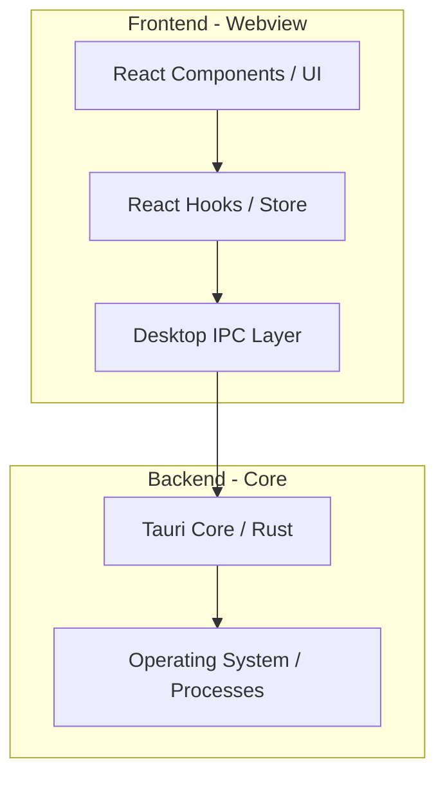
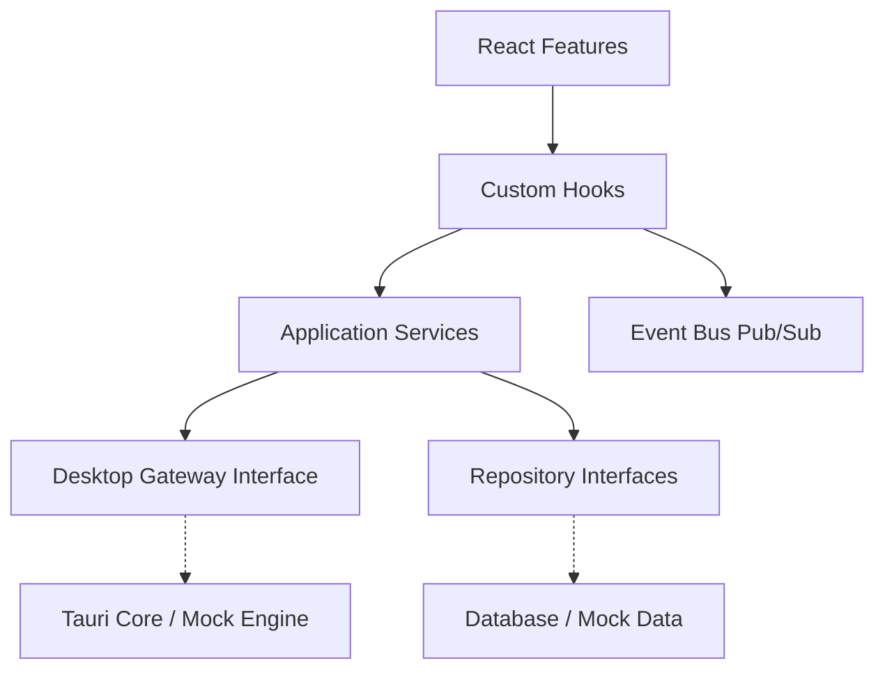
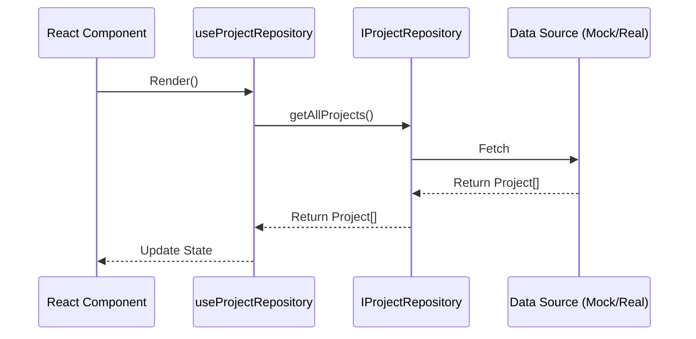
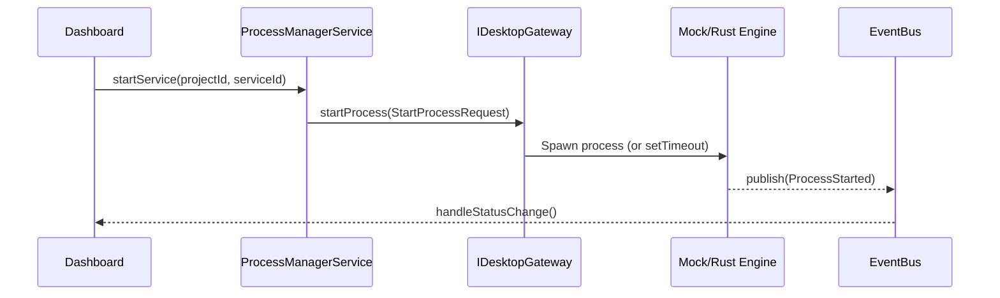
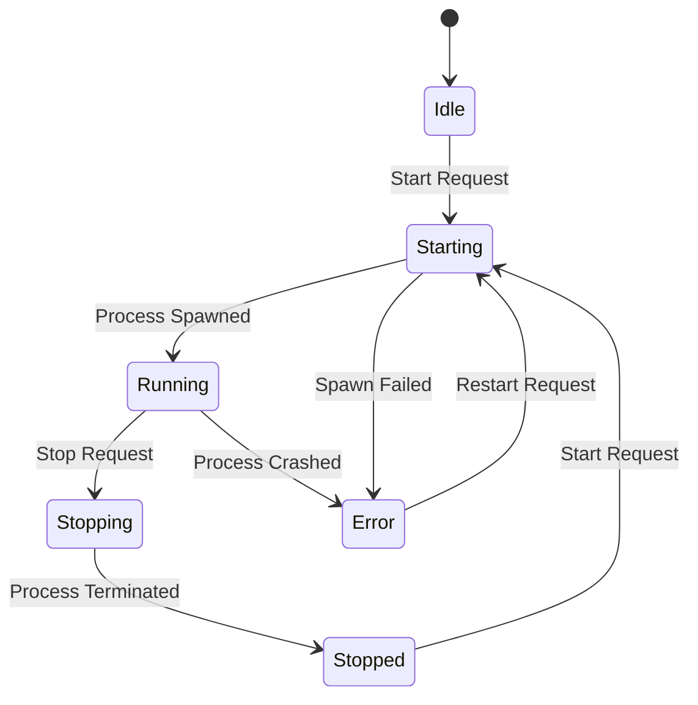
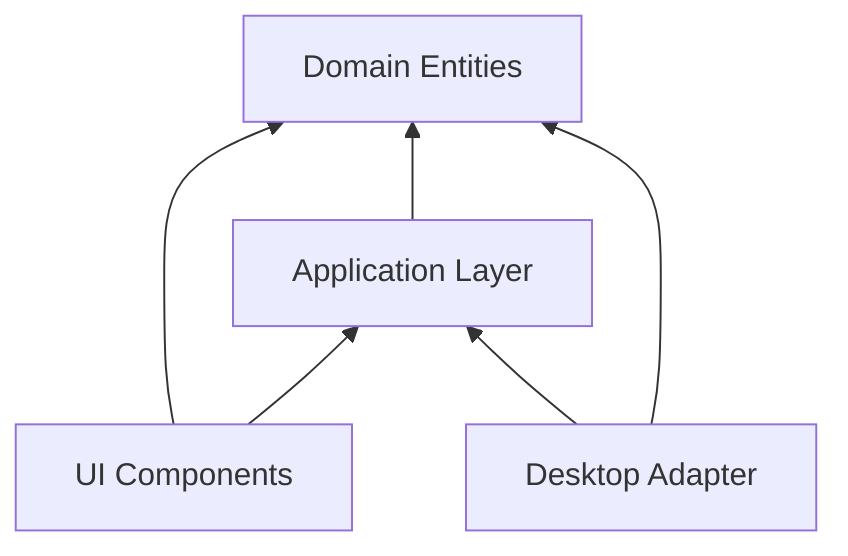

# Developer Control Center

Developer Control Center là ứng dụng Desktop giúp quản lý, khởi động, và giám sát các dự án phát triển (Spring Boot, React, Node.js, Rust...) thông qua giao diện đồ h�a trực quan (GUI) hiện đại, thay vì phải thao tác thủ công qua Command Line.

## 🌟 Architecture Diagram & IPC Flow

Kiến trúc dự án được thiết kế chuẩn **Clean Architecture** và chia theo **Feature-sliced design** để dễ dàng duy trì trong nhi�u năm mà không cần đập đi xây lại.



### IPC Flow (Tiến trình giao tiếp)
1. **User Action:** Ngư�i dùng bấm "Start Project" trên giao diện React.
2. **React Layer:** Component g�i hàm trong Store/Service tương ứng của tính năng.
3. **IPC Layer:** Store không g�i trực tiếp OS, mà mượn qua một Interface trung gian `IpcService` (ví dụ `desktopIpc.startProcess(id)`).
4. **Rust Backend:** Tauri nhận lệnh qua System IPC, thực thi shell command/spawn process.
5. **Callback/Event:** Rust emit sự kiện ngược v� Frontend (VD: log stream, process status).

## � Cấu trúc thư mục (Folder Tree)

```text
E:\Github project\Developer-Control-Center\
├── src-tauri/             # Backend (Rust)
│
├── src/                   # Frontend (React + TS)
│   ├── domain/            # Lớp nghiệp vụ lõi (Entities, Interfaces)
│   │   ├── entities/      # Project, Service, LogEntry...
│   │   ├── repositories/
│   │   └── usecases/
│   │
│   ├── desktop/           # Cầu nối giữa UI và H�H (Chứa toàn bộ Tauri API calls)
│   │   ├── ipc/           # �ịnh nghĩa IPC Services
│   │   ├── process/
│   │   ├── shell/
│   │   └── filesystem/
│   │
│   ├── shared/            # Code dùng chung (UI Components, Utils, Types)
│   │   ├── components/    # (ví dụ: Button, Layout, shadcn/ui)
│   │   ├── hooks/
│   │   ├── types/
│   │   └── utils/
│   │
│   └── features/          # Các phân hệ theo chuẩn Feature-sliced
│       ├── dashboard/
│       ├── projects/
│       ├── processes/
│       ├── logs/
│       ├── workspace/
│       ├── settings/
│       └── terminal/
│           ├── components/ # UI dành riêng cho feature
│           ├── hooks/      # Hook chuyên biệt
│           ├── services/   # Giao tiếp API/IPC
│           ├── stores/     # Zustand state
│           ├── types/      # Types cụ thể cho feature
│           └── pages/      # Entry view (Trang)
└── README.md
```

## 🧩 Module Responsibilities

1. **Domain (`domain/`)**: Chứa định nghĩa dữ liệu (Interfaces/Types), không chứa bất kỳ logic UI hay framework nào.
2. **Desktop (`desktop/`)**: Là adapter duy nhất giao tiếp với Rust/Tauri API. React không được g�i Tauri API ngoài module này.
3. **Shared (`shared/`)**: Chứa các component ngớ ngẩn (Dumb components), hook tiện ích. Tuyệt đối không chứa business logic cụ thể của một feature.
4. **Features (`features/`)**: Chứa logic độc lập của từng chức năng. Các feature KHÔNG được import chéo nhau quá sâu (chỉ nên giao tiếp qua Shared hoặc Domain).

## � Naming & Coding Convention

- **Thư mục & File:**
  - File UI Components: `PascalCase.tsx` (VD: `ProjectList.tsx`).
  - File Utils/Hooks/Services: `camelCase.ts` (VD: `useProject.ts`, `dateFormatter.ts`).
  - Tên thư mục: `kebab-case` hoặc `camelCase` chữ thư�ng (VD: `dashboard`, `shared-components`).
- **Interfaces & Types:** Sử dụng `PascalCase` (VD: `Project`, `ProcessInfo`).
- **Imports:** 
  - Ưu tiên sử dụng absolute path (Alias: `@/shared/...`, `@/features/...`).
  - Không import component từ feature này sang feature khác (nếu dùng chung, hãy đem ra `shared/`).

## � UI Foundation & Design System

Dự án áp dụng một **Design System** toàn diện theo tiêu chuẩn của các IDE hiện đại (VS Code, Docker Desktop).

- **Colors & Themes:** Hỗ trợ Light/Dark mode mặc định thông qua CSS Variables. Các biến màu bao gồm primary, success, danger, warning, info, surface, background, border...
- **Typography & Scale:** Thiết lập chuẩn cho Display, Heading, Body, Caption, Mono.
- **Shared Component Library (Atomic UI):** Hệ thống được xây dựng trên bộ primitive component từ `shadcn/ui` và Headless UI (chạy qua Radix). Tất cả nằm tại `src/shared/components/ui/` và hoàn toàn tuân thủ Component < 300 dòng, không dính líu đến logic business.
- **Icon System:** Wrapper `Icon.tsx` tự động b�c `lucide-react`.

## 🧩 Kiến trúc Application Layer & Sơ đồ mở rộng

Dự án sử dụng mô hình Dependency Injection, chia cắt UI hoàn toàn với hệ thống (OS/Tauri).

### Application Layer Diagram


### Repository Flow


### IPC Flow & Desktop Adapter


### Process State Machine


### Dependency Graph


## 🚀 Hướng dẫn chạy

> **Lưu ý quan tr�ng:** Bạn cần cài đặt **Rust** để có thể build thành ứng dụng Desktop.
> Tham khảo: [https://www.rust-lang.org/tools/install](https://www.rust-lang.org/tools/install)

**Chạy ở chế độ Web (Frontend Only):**
```bash
npm install
npm run dev
```
*(Hiện tại dự án đang chạy hoàn toàn trên Mock Data - Không yêu cầu Backend)*

**Chạy ứng dụng Desktop:**
```bash
npm run tauri dev
```

## 🛣 Roadmap phát triển

**Version 1 (Hoàn thành kiến trúc)**
- [x] Thiết lập Clean Architecture, phân lớp rạch ròi.
- [x] �ịnh nghĩa Domain Layer (Entities).
- [x] Tạo Desktop/IPC Adapter Layer.
- [x] Xây dựng UI Foundation & Design System (Mock Data).

**Version 2 (Core Features - Process Manager)**
- [ ] Gắn IPC thực tế vào backend Rust.
- [ ] Quét và tự nhận diện dự án trong thư mục `E:\Github project`.
- [ ] Tính năng Start/Stop/Restart cho Process.
- [ ] Hiển thị danh sách tiến trình và trạng thái.

**Version 3 (Advanced Monitoring & Terminal)**
- [ ] Gắn Terminal UI tích hợp.
- [ ] ��c và hiển thị Log stream (Real-time).
- [ ] Hiển thị Process Info (RAM, CPU Usage).

**Version 4 (Mở rộng & AI)**
- [ ] Quản lý Docker/Git cơ bản.
- [ ] Tích hợp AI để gợi ý fix lỗi dựa trên Logs.
- [ ] Hỗ trợ cấu hình Multi-workspace.

### Error Handling & Validation
M?i l?i t? Rust du?c chu?n hóa qua DesktopError Struct (Rust) sang DesktopError DTO (TypeScript):
`	ypescript
export interface DesktopError {
  kind: 'ValidationError' | 'PermissionError' | 'UnknownError';
  message: string;
}
`
Ği?u này d?m b?o Frontend luôn nh?n du?c error object c?u trúc rõ ràng thay vì các string l?i thô.
