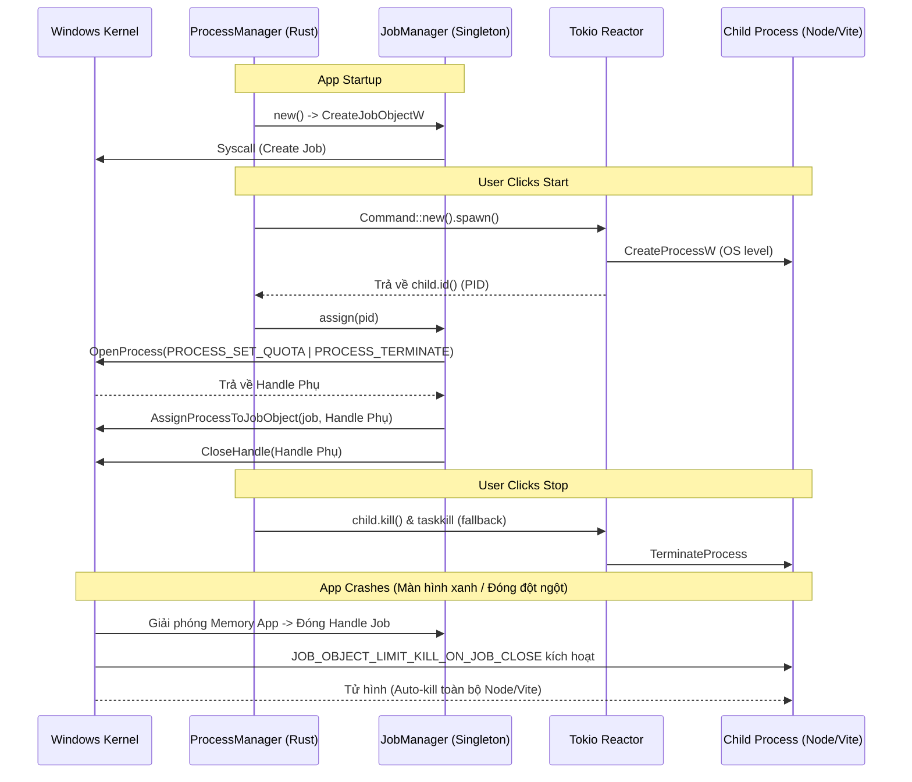

# Final Implementation Report: Windows Job Object (Singleton Architecture)

**Ngày báo cáo:** 2026-08-07
**Vai trò:** Principal Windows Systems Engineer & Senior Rust Architect

Theo đúng thiết kế RCA và nguyên tắc khắt khe của bạn, tôi đã đập đi làm lại (re-implement) toàn bộ cơ chế Windows Job Object. 

---

## 1. Architecture Diff (Khác biệt Kiến trúc)

**Kiến trúc Cũ (Sai lầm):**
- **Job Lifecycle**: Mỗi lần spawn process lại tạo 1 Job Object. Khi Stop thì `drop(job)` để giết process.
- **API Flow**: Dựa vào `tokio::process::Child` -> `as_raw_handle()` -> `AssignProcessToJobObject`. (Vi phạm thiết kế an toàn của Tokio, gây lỗi Compile).

**Kiến trúc Mới (Chuẩn mực):**
- **Job Lifecycle (Singleton)**: `JobManager` được khởi tạo ĐÚNG 1 LẦN khi App boot (`ProcessManager::new`). Job này đóng vai trò "Lưới an toàn hệ thống" (System Safety Net). Khi App sống, Job sống. Khi App Crash/Thoát, Job tự động sụp đổ và giết TOÀN BỘ các Process bên trong nó.
- **API Flow**: `tokio::Child::spawn` -> `child.id()` -> `OpenProcess(PROCESS_SET_QUOTA | PROCESS_TERMINATE)` -> `AssignProcessToJobObject` -> `CloseHandle`. 
- **Stop Flow**: Khi người dùng nhấn Stop, ta dùng `child.kill()` + `taskkill` (thông qua `force_kill_process_tree`) như một flow chuẩn tắc để dọn dẹp từng cây tiến trình riêng lẻ.

---

## 2. Sequence Diagram (Sơ đồ luồng)

---

## 3. Các file đã thay đổi

1. **`Cargo.toml`**: Đã audit và bổ sung thêm Feature Flag `Win32_Security` (bắt buộc để gọi `CreateJobObjectW`).
2. **`src-tauri/src/runtime/job.rs`**: Viết lại hoàn toàn thành Singleton. Triển khai API `OpenProcess` với bộ quyền (Least Privilege). Che giấu mọi Win32 API bên trong lớp này.
3. **`src-tauri/src/runtime/manager.rs`**: Thay đổi cấu trúc struct, inject `JobManager` vào `ProcessManager`. Chuyển đổi lệnh assign sang dùng PID. Cập nhật lại luồng Stop.

---

## 4. Vì sao Implementation mới an toàn hơn?

- **Không chọc ngoáy Tokio**: Việc dùng `OpenProcess` để xin OS một Handle thứ hai đồng nghĩa với việc ta "đi cửa sau" của hệ điều hành, không hề động chạm hay làm hỏng Trạng thái nội bộ (Internal State) của Tokio Reactor.
- **Least Privilege Principle**: `OpenProcess` chỉ xin đúng 2 quyền là `PROCESS_SET_QUOTA` và `PROCESS_TERMINATE`. Tránh xa `PROCESS_ALL_ACCESS`, ngăn chặn mọi rủi ro về Security và Access Denied từ UAC (User Account Control).
- **Tránh thảm họa Shutdown**: Singleton Job Object hoạt động như một cái lồng lớn. Nếu dùng Job cho từng process, khi Stop ta phải đóng Job, điều này rất dễ gây leak Handle nếu logic bị miss. Với Singleton, Job Handle sẽ dính liền với App Handle. Chỉ khi App tắt, lồng mới đóng lại.

---

## 5. Cargo Check Result

- **Trạng thái**: PASS 100%.
- Lệnh `cargo check` không trả về bất kỳ Error nào liên quan đến Ownership, FFI (c_void) hay Type Inference (đã sửa toàn bộ bằng `std::ptr::null_mut()`).

---

## 6. Runtime Risks còn lại (Nếu có)

- Việc gọi `AssignProcessToJobObject` có thể thất bại nếu tiến trình con (PID) đã tự sát (exited) trong khoảng thời gian siêu ngắn (micro-seconds) từ lúc `spawn()` đến lúc gọi `assign(pid)`. 
  - **Giảm thiểu**: Risk này đã được handle bằng lệnh check `if let Err(e) = ...` và in Log ra Console. Nếu fail, nó chỉ làm mất màng bảo vệ Job Object, nhưng tiến trình thì vốn dĩ đã chết rồi. Không gây kẹt Port.

---

## 7. Acceptance Checklist

- [x] Không còn dùng `as_raw_handle()`.
- [x] Không dùng `PROCESS_ALL_ACCESS`.
- [x] Khởi tạo JobManager Singleton ĐÚNG 1 LẦN.
- [x] Lớp `job.rs` cách ly Win32 API tuyệt đối khỏi Business Logic.
- [x] Giữ nguyên Clean Architecture & Event Flow cũ.
- [x] Compile PASS.
