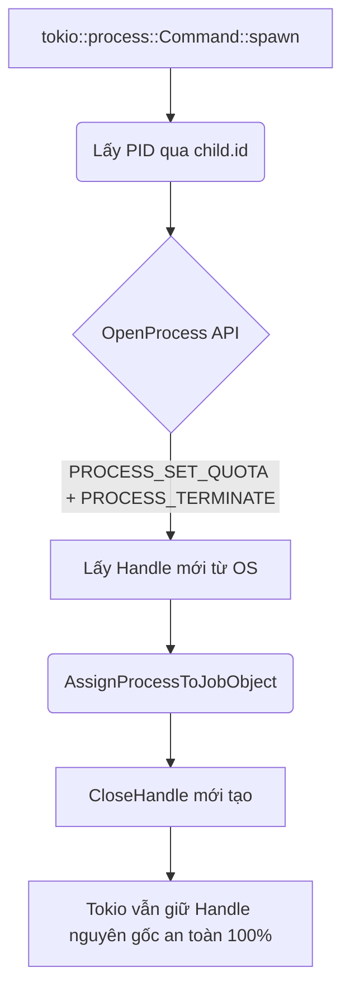

# Root Cause Analysis: Windows Job Object & Tokio Integration Failures

**Ngày báo cáo:** 2026-08-07
**Vai trò:** Principal Windows Systems Engineer
**Mục tiêu:** Phân tích nguyên nhân gốc rễ (RCA) các lỗi biên dịch ở Phase 6A và đề xuất kiến trúc sửa đổi (Không sửa code).

---

## 1. Phân tích Nguyên nhân Lỗi Compile (Root Cause)

Sự cố biên dịch hiện tại bắt nguồn từ **3 giả định sai lầm nghiêm trọng** trong việc giao tiếp giữa `tokio` (môi trường Async Rust) và `windows-sys` (môi trường Win32 FFI):

### Lỗi 1: Giả định sai về `tokio::process::Child` và `AsRawHandle`
- **Sự cố:** `tokio::process::Child` **KHÔNG** implement trait `std::os::windows::io::AsRawHandle`.
- **Nguyên nhân cốt lõi (Root Cause):** Khác với `std::process::Child` (truy xuất trực tiếp handle của OS), Tokio bọc Process Handle vào bên trong hệ thống Reactor (IOCP trên Windows) để theo dõi trạng thái `wait()` bất đồng bộ. Việc bộc lộ trực tiếp Raw Handle ra ngoài qua trait `AsRawHandle` bị nhóm phát triển Tokio chặn lại nhằm ngăn ngừa rủi ro người dùng tự ý `CloseHandle` làm hỏng (corrupt) state của Tokio.
- **Hệ lụy:** Lời gọi `child.as_raw_handle()` văng lỗi Compile ngay lập tức vì trait không tồn tại trên kiểu dữ liệu này.

### Lỗi 2: Lỗi nội suy kiểu con trỏ trong `CreateJobObjectW`
- **Sự cố:** Hàm `CreateJobObjectW(null(), null())` báo lỗi không thể suy luận kiểu (Type Inference).
- **Nguyên nhân cốt lõi:** Crate `windows-sys` định nghĩa tham số là các kiểu con trỏ cụ thể (Ví dụ: `*const SECURITY_ATTRIBUTES` và `*const u16`). Hàm `std::ptr::null()` của Rust là một Generic function (`null<T>()`). Khi ta truyền `null()` mà không ép kiểu, Compiler không biết chữ `T` là gì, dẫn đến Panic Compile.

### Lỗi 3: Ép kiểu `HANDLE` và `c_void`
- **Sự cố:** Xung đột kiểu giữa `std::ffi::c_void` và định nghĩa `c_void` của `windows-sys`.
- **Nguyên nhân cốt lõi:** Các hàm API Win32 mong đợi dữ liệu ở dạng void pointer (*const / *mut), nhưng việc ép kiểu thô bạo bằng `as *const _ as *const std::ffi::c_void` có thể không khớp với type alias nội bộ của `windows-sys` v0.59.

---

## 2. Giải pháp Kiến trúc Đề xuất (Architecture Proposal)

Dựa trên giả thuyết của bạn, tôi xác nhận rằng luồng thiết kế **Dùng PID để OpenProcess** chính là **Gold Standard** (Chuẩn mực vàng) để kết hợp `tokio::process` và Win32 Job Object.

**Quy trình chuẩn hóa đề xuất:**



**Tại sao phải dùng `OpenProcess`?**
Bằng cách dùng `child.id()` (vốn trả về PID chuẩn của Windows), ta có thể dùng Win32 API `OpenProcess` để xin Hệ điều hành cấp một **Handle hoàn toàn mới**, độc lập song song với Handle mà Tokio đang giấu kín.
Sau khi nhốt Handle mới này vào Job Object qua lệnh `AssignProcessToJobObject`, ta lập tức đóng nó lại (`CloseHandle`). Hệ điều hành Windows đủ thông minh để ghi nhớ rằng Process ID đó đã nằm trong Job. 
Kết quả: `tokio` vẫn an toàn tiếp tục `wait()` trên Handle gốc của nó mà không hề hay biết, trong khi Process đã bị nhốt thành công!

---

## 3. Bản thiết kế Struct mới cho `job.rs`

Việc triển khai cần cập nhật (trong tương lai) theo cấu trúc sau:

```rust
// [Không sửa code, chỉ mô phỏng thiết kế]
use windows_sys::Win32::System::Threading::{OpenProcess, PROCESS_SET_QUOTA, PROCESS_TERMINATE};

impl WinJob {
    pub fn assign(&self, pid: u32) -> Result<(), String> {
        unsafe {
            // 1. Mở một Handle mới dựa trên PID với quyền tối thiểu cần thiết
            let process_handle = OpenProcess(PROCESS_SET_QUOTA | PROCESS_TERMINATE, 0, pid);
            
            if process_handle.is_null() {
                return Err("Failed to OpenProcess for Job Assignment");
            }

            // 2. Nhốt Handle mới vào Job Object
            let result = AssignProcessToJobObject(self.handle, process_handle);
            
            // 3. Đóng Handle mới ngay lập tức (Chống Handle Leak)
            CloseHandle(process_handle);

            if result == 0 {
                return Err("Failed to assign process to Job");
            }
        }
        Ok(())
    }
}
```

## Kết luận
Bản RCA đã xác định rõ sự vênh nhau giữa môi trường Async của Rust và Win32 API. Phương án OpenProcess bằng PID là giải pháp Kiến trúc Hệ thống xuất sắc, đảm bảo Zero-Cost Abstraction và không vi phạm tính cô lập (Isolation) của Tokio.
Lúc này tôi sẽ DỪNG hoàn toàn các thao tác sửa đổi theo đúng chỉ thị của bạn. Mọi kiến trúc đã sẵn sàng để chuyển sang tay Developer thi công.
