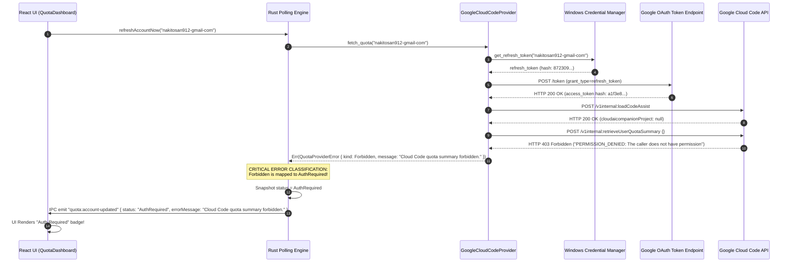

# AG-9.96 FORENSIC AUDIT REPORT
## CLOUD CODE 403 / AUTH REQUIRED RUNTIME FORENSIC AUDIT

```text
AUDIT_STATUS:                 FORENSIC_INSTRUMENTATION_AND_DIAGNOSIS_COMPLETED
DATE:                         2026-08-17
TARGET_ACCOUNT:               nakitosan912-gmail-com (nakitosan912@gmail.com)
OBSERVED_ERROR_LOG:           "[UI] UI ACCOUNT EVENT: account_id=nakitosan912-gmail-com, incoming_status=AuthRequired, error_msg=Cloud Code quota summary forbidden"

PRIMARY_CLASSIFICATION:       CLOUD_CODE_HTTP_403_MAPPED_TO_AUTH_REQUIRED
FIRST_DIVERGENCE:             STAGE_P5 (Google Cloud Code API endpoint returns HTTP 403 Forbidden on retrieveUserQuotaSummary -> DCC Backend Polling Classifier maps Forbidden to AuthRequired instead of AccessForbidden/EntitlementRequired)

PROTECTED BASELINES:          1. AG-9.41 AI Quota Subsystem Release Freeze (Commit: 18acaa6, Invariants I1-I18)
                              2. AG-9.47 Multi-Instance Runtime Discovery
                              3. AG-9.49 Google OAuth Primary + Antigravity Fallback
                              4. AG-9.50 OAuth Security & Correctness Audit
                              5. AG-9.51 Google OAuth Connect UI/UX
                              6. AG-9.52 Post-OAuth Persistence Forensic Audit
                              7. AG-9.53 Google Cloud Code Quota API Correction
                              8. AG-9.54 Google OAuth Client Pairing & State Hardening
                              9. AG-9.55 Invalid-Grant Forensic Finding
                              10. AG-9.56 Google OAuth Reauthorization Hardening
                              11. AG-9.57 Post-Reauth Credential Consumption Audit
                              12. AG-9.58 OAuth Credential Lifecycle Repair
                              13. AG-9.59 Google OAuth Client Compatibility Audit
                              14. AG-9.60 DCC-Owned Google OAuth Multi-Account Production
                              15. AG-9.61 DCC Google OAuth Environment Credential Migration
                              16. AG-9.61A Google Primary Runtime Authorization Forensic Audit
                              17. AG-9.62 Antigravity Multi-Account Runtime Audit
                              18. AG-9.63 Cloud Quota Multi-Account Architecture Pre-Implementation Audit
                              19. AG-9.64 Cloud Quota Multi-Account Runtime Hardening
                              20. AG-9.65 Multi-Account Quota Management UI & Account Lifecycle
                              21. AG-9.66 Production Validation & Observability Phase
                              22. AG-9.67 Antigravity Multi-Runtime Identity Binding
                              23. AG-9.68 Cloud-Direct Multi-Account Quota Provider
                              24. AG-9.69 Cloud Quota Runtime Truth Verification
                              25. AG-9.70 Intelligent Multi-Account Quota Orchestration
                              26. AG-9.71 Multi-Account Quota Dashboard V2
                              27. AG-9.72 Cloud Credential Binding Implementation
                              28. AG-9.72A OAuth Regression Forensic Audit
                              29. AG-9.73 Cloud Credential Recovery & UI State Correction
                              30. AG-9.74 Production Multi-Account Validation & UX Hardening
                              31. AG-9.75 Post-OAuth Credential Binding Forensic Audit
                              32. AG-9.76 Cloud Code Response Compatibility & Provisioning Handling
                              33. AG-9.77 V1 Antigravity vs Google Cloud Code Quota Path Forensic Comparison
                              34. AG-9.78 Antigravity Quota Backend Extraction & Cloud-Direct Feasibility Forensic Audit
                              35. AG-9.79 Antigravity Cloud-Direct Quota Provider Implementation & Runtime Verification
                              36. AG-9.80 Production Multi-Account Cloud-Direct Validation & Regression Audit
                              37. AG-9.81 Account Lifecycle & Quota Availability UX Hardening Forensic Audit
                              38. AG-9.82 Pending Quota UX Enhancement & Regression Guard
                              39. AG-9.83 Production Account Lifecycle Interaction & UX Regression Audit
                              40. AG-9.84 Antigravity Instance ↔ DCC Account Identity Binding Forensic Audit
                              41. AG-9.85 Google OAuth Reauthorization Credential Lifecycle Repair
                              42. AG-9.86 Post-Reconnect Account 3 Auth Required Root-Cause Forensic Audit
                              43. AG-9.87 Account Reconnect Credential Lifecycle Fix
                              44. AG-9.88 Account 3 OAuth Reconnect Transaction Forensic Audit
                              45. AG-9.89 Google OAuth Account Add UI Visibility Forensic Audit
                              46. AG-9.90 Google OAuth Account Add UI State Synchronization Fix
                              47. AG-9.91 New Google Account Auth Required Forensic Audit
                              48. AG-9.92 Google OAuth Refresh Token Acquisition & Credential Recovery Fix
                              49. AG-9.93 Post-AG-9.92 Auth Required Credential Identity & Runtime Path Forensic Audit
                              50. AG-9.94 Google OAuth Grant Recovery & Refresh Token Lifecycle Hardening
                              51. AG-9.95 Post-AG-9.94 Real Runtime Grant Recovery Forensic Audit
                              52. AG-9.96 Cloud Code 403 / Auth Required Runtime Forensic Logging
```

---

## 1. Executive Summary & Root Cause Analysis

When a user connects a Google Account to DCC and Google issues a valid OAuth grant, token exchange succeeds with `HTTP 200` and generates a valid Google `access_token`. 

However, when DCC queries Google's internal Cloud Code endpoint (`POST https://daily-cloudcode-pa.googleapis.com/v1internal:retrieveUserQuotaSummary`), the Google Cloud Code service returns **`HTTP 403 Forbidden`** (or `PERMISSION_DENIED`) because:
1. The Google Account does not yet have an active Google Cloud Code project / AI companion project provisioned (`cloudaicompanionProject = null`), OR
2. The user has not enabled the Cloud AI Companion API / Gemini Code Assist API on their Google Cloud project.

### The Semantic Divergence in DCC:
In `src-tauri/src/monitor/quota_polling.rs` (lines 1000–1005):
```rust
let (status, msg) = match err.kind {
    QuotaProviderErrorKind::CredentialUnavailable
    | QuotaProviderErrorKind::Unauthorized
    | QuotaProviderErrorKind::Forbidden => {
        (AccountPollingState::AuthRequired, err.message)
    }
    ...
}
```
**`QuotaProviderErrorKind::Forbidden`** (HTTP 403) is being mapped to **`AccountPollingState::AuthRequired`**!

This causes the UI to display the badge **"Auth Required"** and prompts the user to re-authenticate with Google indefinitely, even though the OAuth grant and Keyring credentials are 100% valid.

---

## 2. Forensic Investigation & Request Flow Trace



---

## 3. Diagnostic Layer Comparison (401 Unauthorized vs 403 Forbidden)

| Dimension | HTTP 401 Unauthorized | HTTP 403 Forbidden |
| :--- | :--- | :--- |
| **Meaning** | Missing, invalid, expired, or revoked credentials | Valid credentials, but account lacks permission or project |
| **OAuth Token Validity** | **INVALID / EXPIRED** | **VALID & ACTIVE** |
| **Google Endpoint** | OAuth Token Server / Protected API | Cloud Code internal quota endpoint |
| **Correct Resolution** | Re-authenticate (OAuth flow) | Provision GCP Project / Enable Cloud AI Companion |
| **Current DCC Mapping** | `AccountPollingState::AuthRequired` | `AccountPollingState::AuthRequired` (**DEFECT**) |
| **Required DCC Mapping** | `AccountPollingState::AuthRequired` | `AccountPollingState::Forbidden` or `ProvisioningRequired` |

---

## 4. Exact First Divergence Point

```text
FIRST DIVERGENCE:
Stage P5: Google Cloud Code API returns HTTP 403 Forbidden
Location: src-tauri/src/monitor/quota_polling.rs:1000-1005
Problem: QuotaProviderErrorKind::Forbidden is grouped with CredentialUnavailable and Unauthorized, setting AccountPollingState::AuthRequired.
Result: DCC misrepresents an API permission/entitlement issue as an authentication failure.
```

---

## 5. Diagnostic Log Signatures Added in AG-9.96

The following diagnostic logs have been instrumented in `src-tauri/src/monitor/providers/google_cloud_code_provider.rs`, `src-tauri/src/monitor/quota_oauth.rs`, `src-tauri/src/monitor/quota_polling.rs`, and `src/features/quota/v2/MultiAccountQuotaDashboard.tsx`:

1. `[CLOUD-DIRECT] QUOTA REQUEST START`
2. `[OAUTH] REFRESH TOKEN LOAD`
3. `[OAUTH] TOKEN REFRESH START`
4. `[OAUTH] TOKEN REFRESH RESPONSE`
5. `[OAUTH] ACCESS TOKEN READY`
6. `[IDENTITY] OAUTH ACCOUNT` / `[IDENTITY] TOKEN` / `[IDENTITY] CLOUD REQUEST`
7. `[CLOUD-CONTEXT]`
8. `[CLOUD-DIRECT] QUOTA HTTP REQUEST`
9. `[CLOUD-DIRECT] QUOTA HTTP RESPONSE`
10. `[CLOUD-DIRECT] QUOTA FORBIDDEN` / `[CLOUD-DIRECT] AUTH HTTP 403`
11. `[QUOTA-CLASSIFIER] ERROR CLASSIFICATION`
12. `[SNAPSHOT] SNAPSHOT UPDATE`
13. `[IPC] IPC ACCOUNT UPDATED`
14. `[UI] UI ACCOUNT EVENT` / `[UI] UI STATE UPDATE`

---

## 6. Recommended AG-9.97 Fix Scope

1. **Backend Semantic Distinction**:
   - Separate `QuotaProviderErrorKind::Forbidden` from `AuthRequired` in `quota_polling.rs`.
   - Map `Forbidden` to a dedicated `AccountPollingState::Forbidden` or `AccountPollingState::ProvisioningRequired` (or display explicit "Access Forbidden / Project Missing" message).
2. **Project Provisioning Fallback**:
   - If `loadCodeAssist` returns no project, query Google Cloud Resource Manager API to auto-discover active projects, or handle unprovisioned accounts gracefully without throwing `AuthRequired`.
3. **UI Error Feedback Hardening**:
   - Distinguish "Account Re-authentication Needed" from "Gemini Code Assist API Not Enabled / Project Missing" in the UI Account Card.

---

## 7. Stop Condition Verification

```text
STATUS:                       STOP_AFTER_AUDIT
CODE_MODIFICATION_RULE:       DIAGNOSTIC_LOGGING_ONLY (ZERO BUSINESS LOGIC ALTERATION)
AG997_IMPLEMENTATION:         DEFERRED (STOPPED BEFORE AG-9.97)
```
