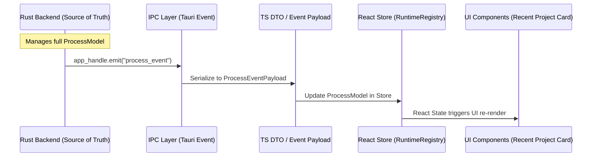

# Architecture Review: Phase 2 - Process Lifecycle Data Propagation

## 1. Runtime Data Flow Diagram

## 2. ProcessModel Field Mapping & Analysis

| Field Name | Type | Used In | Backend Only | Needs IPC | React State | UI Display | Reason |
| :--- | :--- | :--- | :---: | :---: | :---: | :---: | :--- |
| `id` | `String` | Global | ❌ | ✅ | ✅ | ❌ | Key for Registry lookup (`projectId-profileId`). |
| `project_id` | `String` | Global | ❌ | ✅ | ✅ | ❌ | Identifies project context. |
| `profile_id` | `String` | Global | ❌ | ✅ | ✅ | ❌ | Identifies run profile context. |
| `pid` | `Option<u32>` | Backend/TS | ❌ | ✅ | ✅ | ❌ | Used for metrics polling, occasionally debug UI, not primary UI. |
| `parent_pid` | `Option<u32>` | Backend | ✅ | ❌ | ❌ | ❌ | Used for `taskkill /T`, orphan detection. UI/React does not care about OS-level tree topology. |
| `command` | `String` | Global | ❌ | ❌* | ✅ | ✅ | Set during Start request. IPC doesn't need to resend unless it changes. Shown in UI occasionally. |
| `args` | `Option<Vec<String>>` | Backend/TS | ❌ | ❌* | ✅ | ❌ | Same as command. Set at start, no need to sync on every event. |
| `working_directory`| `String` | Global | ❌ | ❌* | ✅ | ❌ | Set at start. No need to sync during lifecycle updates. |
| `status` | `ProcessState`| Global | ❌ | ✅ | ✅ | ✅ | Crucial for UI (Run/Stop button, status badge). Must sync. |
| `start_time` | `Option<u64>` | Global | ❌ | ✅ | ✅ | ✅ | Useful for Uptime calculation in UI. |
| `stop_time` | `Option<u64>` | Global | ❌ | ✅ | ✅ | ❌ | Useful for logs/history, but not critical for active UI. |
| `exit_code` | `Option<i32>` | Global | ❌ | ✅ | ✅ | ✅ | Shown in terminal or error toasts if process fails. |

*(Note: Fields marked with ❌* are part of the initial `StartProcessRequest` and stored in Frontend state upon creation. They do not need to be propagated back via IPC during state transitions like `ProcessStarted` or `ProcessExited`.)*

### 2.1 The `parent_pid` Decision
**Conclusion: DO NOT Propagate to Frontend.**
- **Usage**: Only used for graceful shutdown (`kill -15` / `taskkill`) and `sysinfo` orphan detection.
- **Frontend Need**: Zero. React components do not manage OS process trees. Sending it violates Clean Architecture (leaking OS-specific details to the Presentation layer).

## 3. ProcessState Enum Sync Analysis

### Current Rust Backend `ProcessState` (Source of Truth)
- `Idle`
- `Starting`
- `Running`
- `Stopping`
- `Stopped`
- `Restarting`
- `Failed`
- `Exited`
- `Crashed` (Newly Added in Phase 1)

### Current Frontend `ProcessState.ts`
- `Idle`
- `Starting`
- `Running`
- `Stopping`
- `Stopped`
- `Restarting`
- `Failed`
- `Exited`
- `ZombieDetected` (Missing in Backend)
- `Unknown` (Missing in Backend)

### Gap Analysis & Propagation Strategy
- **`Crashed`**: Needs to be added to Frontend `ProcessState.ts`. It directly affects the UI (e.g., showing a red Error badge instead of standard Stopped, preventing automatic restarts without user intervention).
- **`ZombieDetected`**: This is an anomaly state. If Backend implements Active Guard (sysinfo), it should detect zombies and emit a specific event, but it's fundamentally a backend concern. Frontend should probably just see it as `Failed` or a new `Zombie` state if UI needs to show a specific warning. For now, keep it in Frontend if it has existing logic, but `Crashed` must be synced.
- **`Unknown`**: Standard fallback in TS. No need to exist in Rust.

## 4. IPC Contract Review

### Current Issue in `src/desktop/ipc/index.ts`
The event handler listens for:
- `ProcessStarting`
- `ProcessStarted`
- `ProcessExited`
- `ProcessFailed`

**Missing:**
- `ProcessCrashed`: When Rust emits `Crashed`, the switch case in `index.ts` will ignore it, leaving the UI state stale (likely stuck in `Running`).

## 5. Phase 2 Implementation Plan (Micro-commits)

1. **Step 1: Update Frontend Enum**
   - Add `Crashed = 'crashed'` to `src/domain/entities/ProcessState.ts`.
2. **Step 2: Update IPC Listener**
   - Add `case 'ProcessCrashed':` block in `src/desktop/ipc/index.ts`.
   - Update Store with `status: ProcessState.Crashed`.
   - Publish `EventType.ProcessCrashed`.
3. **Step 3: Update Backend Emits**
   - Verify `src-tauri/src/runtime/service.rs` actually emits `ProcessCrashed` when appropriate (e.g., unexpected exit code).
4. **Step 4: UI Updates**
   - Ensure components consuming `status` handle `ProcessState.Crashed` correctly (e.g., rendering red indicators).

**Result**: We adhere strictly to Clean Architecture. Backend handles `parent_pid` invisibly. Frontend only receives `Crashed` state for Presentation purposes.
