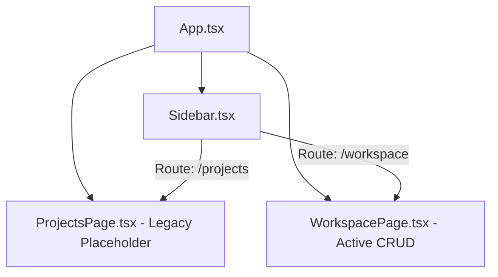
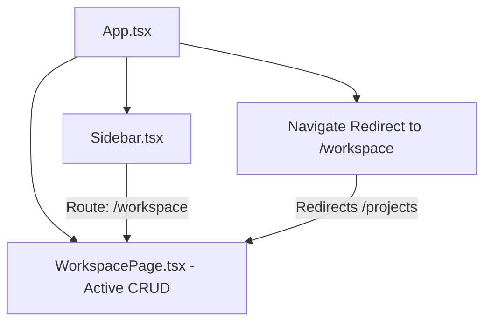

# Report: Legacy Projects Feature Removal

This report documents the migration, clean refactoring, and removal of the legacy `projects` feature from the Developer Control Center application.

---

## 1. Reason for Feature Removal
The legacy `projects` feature (`src/features/projects`) was originally scaffolded during the early stages of development as a standalone feature. However, project management responsibilities were completely absorbed by the `workspace` feature context (`src/features/workspace`) during Phase 5B (Workspace Manager) to enable hierarchical grouping (`Workspace └── Project └── Runtime Profile`), matching the VS Code Workspace design pattern.
As a result, the `projects` feature folder contained only empty folders and a static, non-functional placeholder page, which led to:
- Redundant route definition (`/projects`).
- Duplicated sidebar navigation menu items.
- Dead code paths and confusion regarding project creation ownership.

---

## 2. Architecture Comparison

### Pre-Removal Architecture


### Post-Removal Architecture


---

## 3. Scope of Changes

### Modified Files:
1. **[`src/App.tsx`](file:///E:/Github%20project/Developer-Control-Center/src/App.tsx)**:
   - Removed the import of `ProjectsPage`.
   - Updated the route `/projects` to map to `<Navigate to="/workspace" replace />` for backward compatibility.
2. **[`src/shared/components/layouts/Sidebar.tsx`](file:///E:/Github%20project/Developer-Control-Center/src/shared/components/layouts/Sidebar.tsx)**:
   - Removed the "Projects" navigation item configuration from the sidebar navigation items.

### Deleted Files:
1. **`src/features/projects/pages/ProjectsPage.tsx`** (Deleted)
2. **`src/features/projects/`** directory and all empty subfolders (Deleted)

---

## 4. Impact on System Features

- **Router**: **SAFE** (Requests to `/projects` are automatically and cleanly redirected to `/workspace`).
- **Sidebar**: **SAFE** (Successfully updated, no broken links).
- **Dashboard**: **SAFE** (Dashboard statistics continue to fetch list data correctly from the global `workspace` context).
- **Deep Links & Bookmarks**: **SAFE** (Legacy links to `/projects` redirect to the new workspace manager page).

---

## 5. Rollback Procedures

If for any reason this migration needs to be rolled back:
1. Re-scaffold the `src/features/projects` directory with the placeholder page.
2. Restore the original import and route declarations in `src/App.tsx`:
   ```tsx
   import { ProjectsPage } from './features/projects/pages/ProjectsPage';
   // ...
   <Route path="projects" element={<ProjectsPage />} />
   ```
3. Re-add the sidebar navigation item in `src/shared/components/layouts/Sidebar.tsx`:
   ```typescript
   { icon: 'FolderGit2', label: 'Projects', path: '/projects' },
   ```
