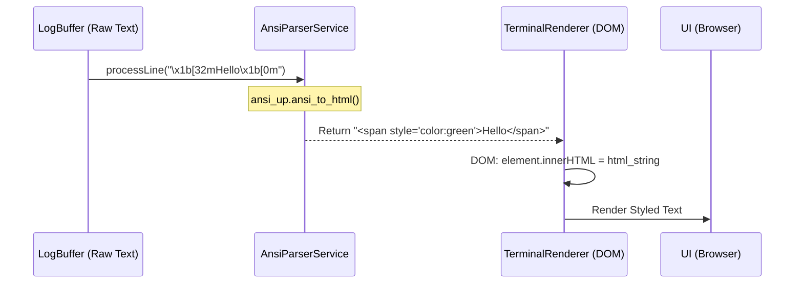

# Architecture Review: Terminal ANSI Rendering

## 1. Pipeline Investigation

Dưới đây là kết quả điều tra toàn bộ luồng truyền tải log từ Process của OS lên giao diện UI:

1. **Rust stdout (`src-tauri/src/runtime/service.rs`)**:
   - Sử dụng `tokio::io::BufReader::new(out).lines()` để đọc từng dòng dưới dạng `String` (UTF-8).
   - **Thực trạng**: Các mã ANSI (ví dụ: `\x1b[32m`) bản chất là các ký tự hợp lệ trong UTF-8 (mã Escape `\u{001b}`) nên chúng được **giữ nguyên vẹn** trong `String`, không bị strip hay parse.
2. **IPC (Tauri Event)**:
   - Dữ liệu được serialize thành JSON qua `app_handle.emit`.
   - **Thực trạng**: JSON bảo toàn hoàn toàn ký tự Escape. Không có sự cố mất mát dữ liệu tại đây.
3. **Frontend Buffer (`LogBufferManager`)**:
   - Lưu trữ `log.message` dưới dạng chuỗi thô (raw string) trong mảng bộ nhớ.
   - **Thực trạng**: Vẫn giữ nguyên ký tự ANSI.
4. **Terminal Renderer (`src/features/terminal/utils/TerminalRenderer.ts`)**:
   - Tại dòng 34: `contentSpan.textContent = log.message;`
   - **Nguyên nhân cốt lõi**: Việc sử dụng thuộc tính `textContent` của DOM Node sẽ yêu cầu trình duyệt render mọi ký tự dưới dạng Plain Text. Trình duyệt không hiểu ký tự Escape `\u{001b}` nên sẽ hiển thị nó thành ký tự rác ``, theo sau là các ký tự ASCII bình thường `[32m`.

**Kết luận**: Hệ thống không thiếu byte hay lỗi encoding, mà là **thiếu một ANSI Parser** ở tầng Presentation (trước khi đưa vào DOM).

## 2. Đánh giá các giải pháp ANSI Parser

Do yêu cầu giữ đầy đủ màu sắc, in đậm (bold), in nghiêng (italic), gạch chân (underline) và màu nền (background), ta có các lựa chọn sau:

| Giải pháp | Bundle Size | Performance | Khả năng mở rộng | Nhận xét |
| :--- | :--- | :--- | :--- | :--- |
| **Tự viết Custom Parser** | Rất nhỏ (~1-2KB) | Trung bình - Cao | Thấp | Phù hợp với 16 màu cơ bản. Sẽ cực kỳ phức tạp nếu CLI output ra chuẩn 256-color hoặc 24-bit TrueColor. Dễ sinh bug Regex. |
| **`ansi-to-html`** | Nhỏ (~4KB) | Trung bình | Khá | Chuyển đổi chuỗi ANSI thành chuỗi HTML với thẻ ``. |
| **`ansi_up`** | Nhỏ (~5KB) | Tốt | Tốt | Tương tự `ansi-to-html` nhưng an toàn hơn vì nó tự động HTML-escape các script độc hại (chống XSS), hỗ trợ đủ TrueColor. |
| **`xterm.js`** | Rất lớn (~200KB+) | Cực kỳ cao (Canvas/WebGL) | Tuyệt đối | Đây là một Terminal Emulator hoàn chỉnh, overkill cho nhu cầu chỉ view log. Phá vỡ kiến trúc `TerminalRenderer` hiện tại. |

**Khuyến nghị**: Sử dụng **`ansi_up`** (hoặc một thư viện tương đương nhẹ nhàng như `ansicolor`).
- Nó đáp ứng đúng tiêu chí: Không làm phình Bundle Size (so với xterm.js).
- Giữ được kiến trúc DOM Pruning (`TerminalRenderer`) cực nhanh đã được quyết định ở Phase 1.
- Hỗ trợ đầy đủ format (bold, italic, colors).
- An toàn XSS khi chèn vào `innerHTML`.

## 3. Thiết kế Clean Architecture cho ANSI Parser

Để Parser độc lập với UI và có thể tái sử dụng (ví dụ: cho File Log Viewer sau này), ta sẽ áp dụng Design Pattern **Adapter / Formatter**.

### 3.1. Cấu trúc thư mục đề xuất
- **`src/shared/utils/AnsiParser.ts`**: Nơi khởi tạo instance của `ansi_up` (hoặc custom logic). Cung cấp hàm `parse(raw: string): string` hoặc trả về mảng các `RenderToken` nếu muốn tự tạo DOM Nodes thay vì dùng `innerHTML`.
- **`src/features/terminal/utils/TerminalRenderer.ts`**: 
  - Inject `AnsiParser` vào Renderer.
  - Thay đổi logic `contentSpan.textContent = log.message` thành `contentSpan.innerHTML = AnsiParser.parse(log.message)`.

### 3.2. Đảm bảo an toàn XSS
Khi sử dụng `innerHTML`, log xuất ra từ ứng dụng của người dùng có thể chứa thẻ `<script>`. Do đó, `AnsiParser` **BẮT BUỘC** phải escape HTML entities (`<` thành `&lt;`, `>` thành `&gt;`) TRƯỚC hoặc TRONG khi xử lý ANSI. Thư viện `ansi_up` mặc định đã làm điều này.

## 4. Kế hoạch triển khai (Phase 3)

- **Bước 1**: Cài đặt thư viện parse (`npm install ansi_up`).
- **Bước 2**: Tạo file `src/shared/utils/AnsiParser.ts` wrap thư viện này thành một service thuần tuý, không dính dáng tới React hay DOM.
- **Bước 3**: Cập nhật `src/features/terminal/utils/TerminalRenderer.ts`:
  - Import `AnsiParser`.
  - Thay đổi cách tạo node trong `createLogElement`: Gán `innerHTML` thay vì `textContent`.
- **Bước 4**: Chạy thử một lệnh có xuất ANSI (như `npm run dev` hoặc một file bash tự viết) để nghiệm thu màu sắc, bold, background.
